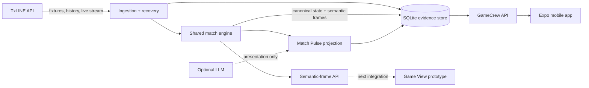

# GameCrew

**See the match taking shape.**

GameCrew is a mobile-first football match companion that turns live match events into a clear, evolving story. Instead of another wall of scores and statistics, fans get concise, source-grounded commentary in **Match Pulse** and an illustrative view of pressure and progression in **Game View**.

> TxLINE owns the match facts. GameCrew explains and presents them without inventing match truth.

## Why GameCrew

A score tells you what happened; it rarely explains how the match is changing. GameCrew gives second-screen fans a fast way to:

- discover live, upcoming, and replayable fixtures;
- follow important events through readable, moment-by-moment commentary;
- understand pressure, restarts, and turning points without scanning dense dashboards;
- replay historical fixtures when no live match is available; and
- move between the factual Match Pulse feed and an explicitly illustrative Game View.

GameCrew is not a betting product and does not claim access to video, player tracking, or exact ball coordinates.

## Product highlights

### Match Pulse

Match Pulse converts normalized TxLINE signals into a durable commentary timeline. Routine play, pressure sequences, goals, cards, restarts, and phase changes are grouped into meaningful beats with exact source provenance.

### Game View

Game View is a probable, source-honest visualization of how a passage of play may be developing. The current submission uses a scripted demo sequence to prove the presentation; connecting the backend's semantic frames to that consumer is the next integration step. Illustrative positioning is never presented as real tracking data.

### Replay-ready match intelligence

The same ingestion path supports live streams, recovery from historical data, and saved fixtures. This makes the core experience demonstrable even when no match is live.

### Grounded by design

- **TxLINE** is the source of external match facts.
- **SQLite** stores raw evidence, canonical state, semantic frames, and consumer projections.
- **The shared match engine** interprets each source update once.
- **The LLM is optional** and may improve wording only. Deterministic validation rejects unsupported output, and a grounded fallback remains available.
- **Clients use GameCrew APIs** and never interpret TxLINE directly.

## How it works



Corrections are replayed through the engine with generation-aware projections, so clients can replace stale state rather than combining incompatible timelines. See the [architecture notes](docs/architecture/match_pulse_vps_sqlite.md) for the persistence, recovery, and validation model.

## Tech stack

| Layer | Technology |
| --- | --- |
| Mobile app | Expo, React Native, Expo Router |
| API | Hono, TypeScript, Node.js |
| Match engine | Shared TypeScript package |
| Persistence | SQLite via `node:sqlite` |
| Data source | TxLINE |
| Web presence | React and Vite |
| Workspace | pnpm monorepo |

## Repository structure

```text
apps/
  api/       Hono API, TxLINE ingestion, persistence, and commentary workers
  mobile/    Expo app with match discovery, Match Pulse, and Game View
  web/       GameCrew product landing page
packages/
  core/      Shared match types, TxLINE adapters, engine, and validation
docs/
  architecture/  System design and review handoffs
  prds/          Product requirements
```

## Run locally

### Prerequisites

- Node.js 24 or newer (the backend uses Node's built-in SQLite module)
- pnpm 11.7 or newer
- a TxLINE API token
- Expo Go, an Android emulator, or an iOS simulator for the mobile client

### 1. Install dependencies

```bash
pnpm install
```

### 2. Configure the API

Create `.env.local` at the repository root:

```dotenv
TXLINE_API_TOKEN=your_txline_api_token

# Optional: presentation-only Match Pulse enrichment
MATCH_PULSE_LLM_ENABLED=false
MATCH_PULSE_LLM_BASE_URL=
MATCH_PULSE_LLM_API_KEY=
MATCH_PULSE_LLM_MODEL=gemma-4-12b-it
```

The API defaults to `http://localhost:8787` and stores local SQLite data under `apps/api/.data/`.

### 3. Start the API

```bash
pnpm api
```

Confirm it is running:

```bash
curl http://localhost:8787/health
```

### 4. Start the mobile app

In another terminal:

```bash
pnpm mobile
```

The mobile app uses `http://localhost:8787` by default. For a physical device, create `apps/mobile/.env.local` with a reachable address on your local network:

```dotenv
EXPO_PUBLIC_GAMECREW_API_URL=http://YOUR_COMPUTER_LAN_IP:8787
```

Use `http://10.0.2.2:8787` for the standard Android emulator.

### Optional: run the landing page

```bash
pnpm --filter @gamecrew/web dev
```

## API surface

| Endpoint | Purpose |
| --- | --- |
| `GET /health` | API and ingestion health |
| `GET /matches` | Combined live and durable fixture discovery |
| `GET /matches/:fixtureId/pulse/commentary` | Saved, generation-safe Match Pulse feed |
| `GET /matches/:fixtureId/engine/state` | Canonical engine checkpoint |
| `GET /matches/:fixtureId/engine/frames` | Semantic frames after a revision |

`GET /matches` accepts optional `filter` (`live`, `upcoming`, `replay`, or `hosted`) and `limit` query parameters.

## Verification

Run the focused package suites and workspace checks:

```bash
pnpm --filter @gamecrew/core test
pnpm --filter @gamecrew/api test
pnpm typecheck
```

Run the recorded TxLINE fixture through ingestion and grounded commentary projection:

```bash
pnpm --filter @gamecrew/api ingestion:smoke -- 18179759
pnpm --filter @gamecrew/api commentary:smoke -- 18179759
```

The smoke flow verifies a finalised 886-record fixture, its canonical 2–0 result, semantic-frame provenance, and durable commentary beats.

## Product principles

1. Source evidence outranks generated presentation.
2. Unknown data stays unknown; GameCrew does not fill gaps with confident guesses.
3. Every source-driven consumer starts from the same canonical match state.
4. Corrections replace stale projections safely.
5. The mobile experience stays useful when the LLM or TxLINE is temporarily unavailable.

For the broader product direction, read the [GameCrew vision](docs/vision.md) and [Match Pulse product requirements](docs/prds/match_pulse_timeline.md).
