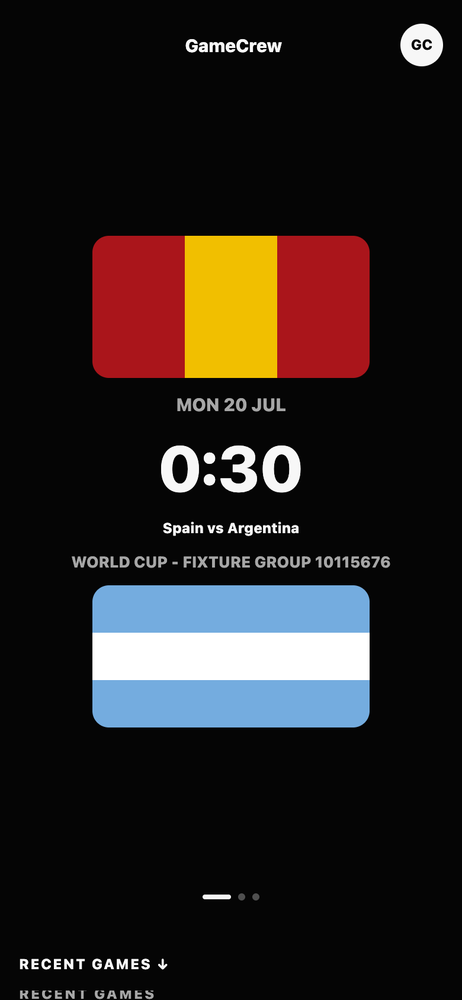
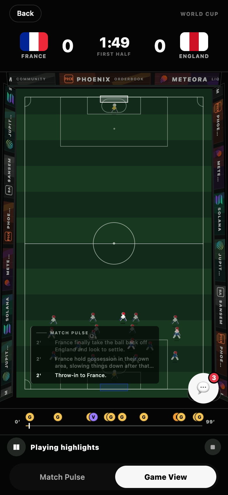
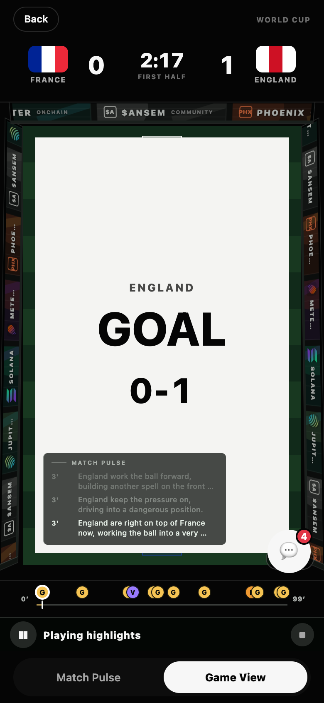
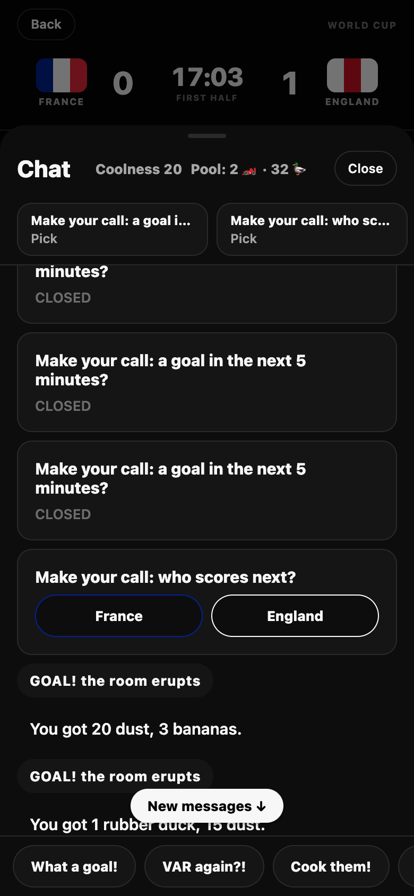
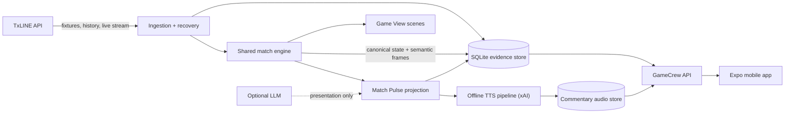

# GameCrew

**See the match taking shape. Hear it, too.**

GameCrew is a mobile-first football match companion that turns live match events into a clear, evolving story. Instead of another wall of scores and statistics, fans get concise, source-grounded commentary in **Match Pulse**, an illustrative view of pressure and progression in **Game View**, and a broadcast-style **voice commentator** calling the game over a stadium crowd — all synchronized to the same match truth.

> TxLINE owns the match facts. GameCrew explains and presents them without inventing match truth.

**Live:** [🎬 Demo video](https://youtu.be/SuQjXCbAEII) · [Landing page](https://gamecrew-web.vercel.app) · [Documentation](https://gamecrew-docs.vercel.app)

[](https://youtu.be/SuQjXCbAEII)

|  |  |  |  |
| :--: | :--: | :--: | :--: |
| **Home** | **Game View** | **Goal takeover** | **Chat & economy** |

## Why GameCrew

A score tells you what happened; it rarely explains how the match is changing. GameCrew gives second-screen fans a fast way to:

- discover live, upcoming, and replayable fixtures;
- follow important events through readable, moment-by-moment commentary — or listen to it, like a podcast of the match;
- jump to any big moment as a bounded highlight clip, or fold the whole match into a TV-style highlights reel;
- understand pressure, restarts, and turning points without scanning dense dashboards;
- play along with no-real-money calls, earn Coolness, and claim playful trophies as collectibles; and
- move between the factual Match Pulse feed and an explicitly illustrative Game View.

GameCrew is not a betting product and does not claim access to video, player tracking, or exact ball coordinates.

## Product highlights

### Match Pulse

Match Pulse converts normalized TxLINE signals into a durable commentary timeline. Routine play, pressure sequences, goals, cards, restarts, and phase changes are grouped into meaningful beats with exact source provenance.

### Voice commentary

Every commentary line can speak. An offline pipeline voices the match with xAI text-to-speech (with speech-tag "drama direction": a breath before a goal call, a pause before VAR, soft comedowns after), stores per-line mp3 clips fingerprinted by text, voice, and speed, and serves them next to the feed. On the phone, big moments interrupt mid-sentence, routine lines drop rather than queue, and the crowd bed ducks under the commentator. On a live match the commentary follows you out of the screen — a now-listening bar on Home brings you back mid-stream.

### Game View

Game View is a probable, source-honest visualization of how a passage of play may be developing, driven by the same semantic match frames as Match Pulse — the pitch, the pressure, goal and VAR takeovers, and LED perimeter boards carrying ecosystem partners. Illustrative positioning is never presented as real tracking data.

### Checkpoints and highlights

Every big moment (goals, cards, VAR, penalties) becomes a checkpoint on a shared rail across both tabs. Tapping one plays a bounded clip — roughly a minute before the moment to a minute after, celebration included — then settles back to the full-time board. "Play highlights" chains the clips into a reel; "Watch full match" replays end to end. A transport strip (play/pause, state label, crowd and voice toggles) makes playback state explicit on both tabs.

### Playful economy

Joining a match hands the fan a playful gift — a bike, a pizza, even a Lambo. Gifts stake calls ("who scores next?") that the real TxLINE event settles; correct calls earn Coolness and climb the match board. Selected trophies can be claimed as collectibles on Solana devnet via an embedded wallet — verifiable bragging rights with no deposits, no cash-outs, and no real-money wagering. Chat is a slide-up sheet over the match: reactions-only composer, pinned open calls, and simulated room ambience clearly separated from real user actions.

### Replay-ready match intelligence

The same ingestion path supports live streams, recovery from historical data, and saved fixtures. Finished matches open parked on a full-time board (score, scorer timeline, actions) rather than auto-replaying. This makes the core experience demonstrable even when no match is live.

### Grounded by design

- **TxLINE** is the source of external match facts.
- **SQLite** stores raw evidence, canonical state, semantic frames, consumer projections, and voiced audio.
- **The shared match engine** interprets each source update once.
- **The LLM is optional** and may improve wording only. Deterministic validation rejects unsupported output (including unsupported "comeback" or "equaliser" claims), and a grounded fallback remains available.
- **Voice is presentation only**, generated offline from validated commentary text — never during a live match.
- **Clients use GameCrew APIs** and never interpret TxLINE directly.

## How it works



Corrections are replayed through the engine with generation-aware projections, so clients can replace stale state rather than combining incompatible timelines. See the [architecture notes](docs/architecture/match_pulse_vps_sqlite.md) for the persistence, recovery, and validation model.

## Tech stack

| Layer | Technology |
| --- | --- |
| Mobile app | Expo, React Native, Expo Router |
| API | Hono, TypeScript, Node.js |
| Match engine | Shared TypeScript package |
| Persistence | SQLite via `node:sqlite` |
| Data source | TxLINE |
| Voice commentary | xAI text-to-speech (offline generation, per-line caching) |
| Collectible claims | Solana devnet via embedded wallet (Privy) |
| Web presence | React and Vite |
| Documentation | Astro Starlight |
| Workspace | pnpm monorepo |

## Repository structure

```text
apps/
  api/       Hono API, TxLINE ingestion, persistence, commentary + TTS workers
  docs/      Starlight documentation site (gamecrew-docs.vercel.app)
  mobile/    Expo app: match discovery, Match Pulse, Game View, voice, economy
  web/       GameCrew product landing page (gamecrew-web.vercel.app)
packages/
  core/      Shared match types, TxLINE adapters, engine, economy, validation
docs/
  architecture/  System design and review handoffs
  prds/          Product requirements
```

## Run locally

### Prerequisites

- Node.js 24 or newer (the backend uses Node's built-in SQLite module)
- pnpm 11.7 or newer
- a TxLINE API token
- Expo Go, an Android emulator, an iOS simulator, or a web browser for the mobile client

### 1. Install dependencies

```bash
pnpm install
```

### 2. Configure the API

Create `.env.local` at the repository root:

```dotenv
TXLINE_API_TOKEN=your_txline_api_token

# Optional: override the TxLINE endpoint
TXLINE_BASE_URL=

# Optional: presentation-only Match Pulse enrichment
MATCH_PULSE_LLM_ENABLED=false
MATCH_PULSE_LLM_BASE_URL=
MATCH_PULSE_LLM_API_KEY=
MATCH_PULSE_LLM_MODEL=

# Optional: offline voice commentary generation
XAI_API_KEY=

# Optional: playful economy claims on Solana devnet
SOLANA_RPC_URL=
ECONOMY_PAYER_PATH=
```

The API defaults to `http://localhost:8787` and stores local SQLite data under `apps/api/.data/`.

### 3. Start the API

```bash
pnpm api
```

Confirm it is running:

```bash
curl http://localhost:8787/health
```

### 4. Start the mobile app

In another terminal:

```bash
pnpm mobile
```

The mobile app uses `http://localhost:8787` by default. For a physical device, create `apps/mobile/.env.local` with a reachable address on your local network:

```dotenv
EXPO_PUBLIC_GAMECREW_API_URL=http://YOUR_COMPUTER_LAN_IP:8787
```

Use `http://10.0.2.2:8787` for the standard Android emulator.

### Optional: voice a match

With `XAI_API_KEY` set, generate commentary audio for a fixture (per-line fingerprinting means re-runs only bill changed lines; a full match costs roughly twenty cents):

```bash
pnpm --filter @gamecrew/api tts:generate -- --fixture=<fixtureId> --voice=kepler --speed=1.1
pnpm --filter @gamecrew/api tts:smoke   # one-line live contract check
```

### Optional: run the landing page

```bash
pnpm --filter @gamecrew/web dev
```

## API surface

| Endpoint | Purpose |
| --- | --- |
| `GET /health` | API and ingestion health |
| `GET /matches` | Combined live and durable fixture discovery |
| `GET /matches/:fixtureId/pulse/commentary` | Saved, generation-safe Match Pulse feed |
| `GET /matches/:fixtureId/pulse/commentary/audio` | Voiced-line manifest for a fixture |
| `GET /matches/:fixtureId/pulse/commentary/audio/:entryId` | Per-line commentary audio (mp3, ETag-cached) |
| `GET /matches/:fixtureId/engine/state` | Canonical engine checkpoint |
| `GET /matches/:fixtureId/engine/frames` | Semantic frames after a revision |

`GET /matches` accepts optional `filter` (`live`, `upcoming`, `replay`, or `hosted`) and `limit` query parameters.

## Verification

Run the package suites and workspace checks:

```bash
pnpm --filter @gamecrew/core test
pnpm --filter @gamecrew/api test    # includes the network-free TTS pipeline suite
pnpm --filter mobile test           # pure-logic suites for playback, voice, chat, economy surfaces
pnpm typecheck
```

Run the recorded TxLINE fixture through ingestion and grounded commentary projection:

```bash
pnpm --filter @gamecrew/api ingestion:smoke -- 18179759
pnpm --filter @gamecrew/api commentary:smoke -- 18179759
```

The smoke flow verifies a finalised 886-record fixture, its canonical 2–0 result, semantic-frame provenance, and durable commentary beats.

## Product principles

1. Source evidence outranks generated presentation.
2. Unknown data stays unknown; GameCrew does not fill gaps with confident guesses.
3. Every source-driven consumer starts from the same canonical match state.
4. Corrections replace stale projections safely.
5. Play money only: Coolness and collectibles never touch deposits, cash-outs, or real-money wagering.
6. The mobile experience stays useful when the LLM, the voice pipeline, or TxLINE is temporarily unavailable.

For the broader product direction, read the [GameCrew vision](docs/vision.md) and [Match Pulse product requirements](docs/prds/match_pulse_timeline.md).
