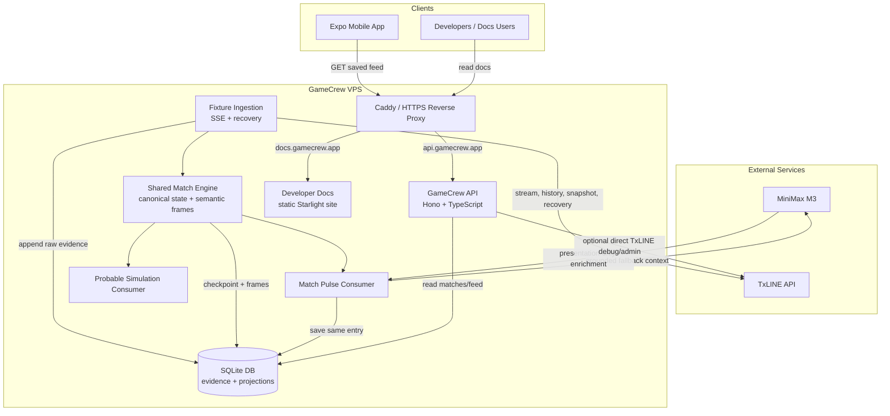
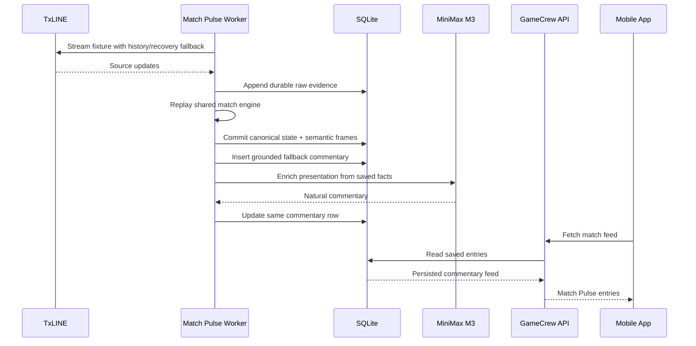

# Match Pulse VPS + SQLite Architecture

Match Pulse V1 runs on a GameCrew-controlled VPS. TxLINE remains the source of match facts, while the GameCrew server persists raw source evidence, canonical match state, semantic frames, and the saved commentary feed in SQLite. Match Pulse and the probable game simulation consume the same shared match engine. Clients read GameCrew-owned projections through the API; they do not process TxLINE directly.



Core ownership rule:

```text
TxLINE is the source of external match facts.
SQLite is GameCrew's durable source of evidence and product projections.
The shared match engine interprets each source event once for both consumers.
The LLM may improve presentation but never changes match truth.
The client never processes TxLINE.
The client only reads saved state, frames, and commentary from the API.
```

Live match flow:



Persistence direction:

```text
File store today = proof
SQLite store next = V1 production
Postgres/Supabase later = scale-up option
```

Recovery and finalisation rules:

```text
A snapshot baseline is temporary recovery state when GameCrew starts late.
If complete history from Seq 0 becomes available, the engine replaces the
baseline and rebuilds the fixture from the full timeline.

After game_finalised, ingestion remains open for a bounded correction window
(15 minutes by default, configured by TXLINE_FINALISATION_CORRECTION_MS).
Corrections inside that window are persisted and projected. Any correction that
rewrites earlier projection history advances the generation; consumers reset
their prior generation before applying that corrected replay.
```

Runtime note:

```text
The current SQLite implementation uses Node's built-in node:sqlite module.
Run the VPS API/worker on Node 24 or newer, and expect an experimental warning
until Node marks this module stable. If that becomes unacceptable, replace the
driver behind the same store interface with a stable SQLite package.
```
