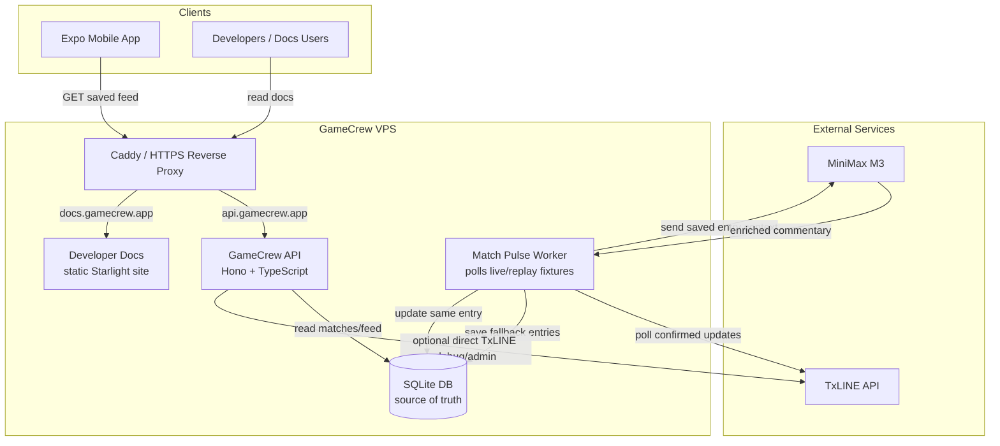
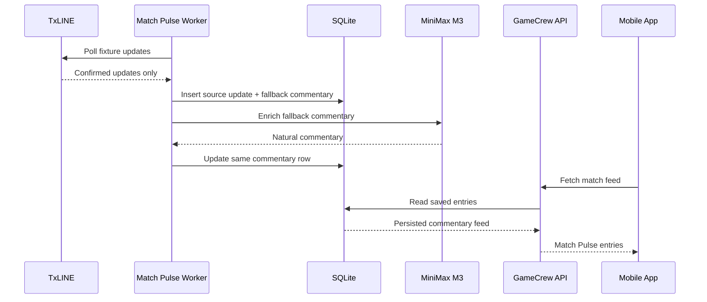

# Match Pulse VPS + SQLite Architecture

Match Pulse V1 runs on a GameCrew-controlled VPS. TxLINE remains the source of match facts, while the GameCrew server persists the saved commentary feed in SQLite. Clients read the saved feed through the API; they do not process TxLINE directly.



Core ownership rule:

```text
TxLINE is the source of match facts.
SQLite is GameCrew's source of truth for the saved Match Pulse feed.
The client never processes TxLINE.
The client only reads saved commentary from the API.
```

Live match flow:



Persistence direction:

```text
File store today = proof
SQLite store next = V1 production
Postgres/Supabase later = scale-up option
```

Runtime note:

```text
The current SQLite implementation uses Node's built-in node:sqlite module.
Run the VPS API/worker on Node 24 or newer, and expect an experimental warning
until Node marks this module stable. If that becomes unacceptable, replace the
driver behind the same store interface with a stable SQLite package.
```
